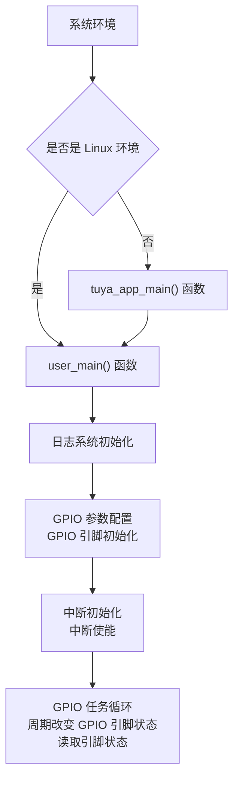

# GPIO

## GPIO 简介

GPIO:（General Purpose Input/Output）即通用输入输出接口，是嵌入式系统中用于**控制外部设备或读取外部信号**的基本数字接口。每个 GPIO 引脚可以被软件配置为输入或输出模式，在输入模式下可以读取引脚的电平状态（高电平或低电平），在输出模式下可以控制引脚输出高电平或低电平。

## GPIO 关键概念解释

- GPIO 工作模式

    - 输入模式：引脚被配置为输入，用于读取外部信号电平

    - 输出模式：引脚被配置为输出，用于控制外部设备

- GPIO 电平状态

    - 高电平：通常表示逻辑1，电压接近供电电压（如3.3V）

    - 低电平：通常表示逻辑0，电压接近地电平（0V）

- GPIO 中断功能

    GPIO 支持中断机制，当引脚电平发生变化时可以触发中断处理函数，实现事件驱动的程序设计。

## GPIO 使用流程

1. GPIO 参数配置：根据需要初始化 TUYA_GPIO_BASE_CFG_T 类型结构体，设置 GPIO 的**工作模式、方向和电气特性**

2. GPIO 初始化：调用 tkl_gpio_init() 初始化函数使配置生效

3. GPIO 读写操作：使用 tkl_gpio_read() **读取输入引脚状态**;使用 tkl_gpio_write() **控制输出引脚电平**

如果需要启用中断功能，在将中断引脚配置为输入模式后还需进行以下配置：

1. 初始化 irq_cfg 中断配置结构体，设置中断的**回调函数**、**触发模式**等

2. 使用 tkl_gpio_irq_init() 初始化函数**使中断配置生效**

3. 使用 tkl_gpio_irq_enable() **开启中断**

## 示例代码配置

### 开发板配置

在使用本例程前，需在 GPIO **项目根目录**中确认开发板是否选择正确。

- 开发板选择方法：

    - 在项目根目录中执行开发板选择命令，输入要选择的开发板的型号：

        ```shell
        tos.py config choice
        ```

    - 比如要选择 TUYA_T5AI_CORE ：

        因为**T5AI 有多个型号**，如 TUYA_T5AI_CORE 、 TUYA_T5AI_BOARD等。在使用 `tos.py config choice` 成功选择 T5AI 开发板后,还要使用 `tos.py config menu` 命令进入配置菜单，在 `Choice a board` 目录下继续选择 T5AI的子型号。


### GPIO 参数配置

- 输入输出配置：

```c
    //典型的 GPIO 配置结构体如下：
    TUYA_GPIO_BASE_CFG_T out_pin_cfg = {
        .mode = TUYA_GPIO_PUSH_PULL,     // 推挽输出模式
        .direct = TUYA_GPIO_OUTPUT,      // 输出方向
        .level = TUYA_GPIO_LEVEL_LOW     // 初始电平为低
    };

    TUYA_GPIO_BASE_CFG_T in_pin_cfg = {
        .mode = TUYA_GPIO_PULLUP,        // 上拉输入模式
        .direct = TUYA_GPIO_INPUT,       // 输入方向
    };
```

- 中断配置

```c
    // GPIO 中断配置结构体：
    TUYA_GPIO_IRQ_T irq_cfg = {
        .cb = __gpio_irq_callback,       // 中断回调函数
        .arg = NULL,                     // 回调函数参数
        .mode = TUYA_GPIO_IRQ_RISE,      // 上升沿触发
    };
```

## 编译与运行

### 编译步骤

1. 配置好 TuyaOpen 开发环境，进入**项目根目录**

2. 确保目标平台（ T5AI/T3 ）选择正确

3. 执行编译命令生成可执行固件

### 运行及日志

将编译好的固件烧录到目标设备，设备启动后使用以下命令查看运行日志：

```shell
tos.py monitor
```

预期运行日志：
```c
[01-01 00:00:00 ty I][example_gpio.c:xx] pin output high
[01-01 00:00:00 ty I][example_gpio.c:xx] GPIO read high level
[01-01 00:00:02 ty I][example_gpio.c:xx] pin output low
[01-01 00:00:02 ty I][example_gpio.c:xx] GPIO read low level
```

## 示例代码流程

1. 系统初始化：如果是 Linux 环境，直接调用 user_main()；其他环境则进入 tuya_app_main() 创建 user_main() 线程

2. 日志系统初始化：通过 tal_log_init() 函数**初始化日志系统**

3. GPIO 参数配置：初始化 out_pin_cfg 、 in_pin_cfg 和 irq_cfg 结构体，设置输出引脚、输入引脚和中断引脚参数，

4. GPIO 初始化和中断使能：调用 tkl_gpio_init() 函数对 **GPIO 初始化**，调用 tkl_gpio_irq_init() 函数对**中断初始化**，调用 tkl_gpio_irq_enable() 函数**使能中断**

4. 任务循环：周期性改变输出引脚状态；读取输入引脚状态；处理中断事件



## 主要接口举例

涂鸦 IoT 平台提供了**硬件抽象层**（TAL, Tuya Abstract Layer）和**硬件驱动层**（TKL, Tuya Kernel Layer）接口来统一访问硬件资源。

- GPIO 初始化

    ```c
    OPERATE_RET tkl_gpio_init(TUYA_GPIO_NUM_E pin_id, CONST TUYA_GPIO_BASE_CFG_T *cfg);
    ```

    - 功能：初始化指定 GPIO 引脚

    - 参数：

        pin_id：GPIO 引脚编号

        cfg：GPIO 配置参数指针

    - 返回值：操作结果状态码
***
- GPIO 写操作

    ```c
    OPERATE_RET tkl_gpio_write(TUYA_GPIO_NUM_E pin_id, TUYA_GPIO_LEVEL_E level);
    ```

    - 功能：设置 GPIO 输出电平

    - 参数：

        pin_id：GPIO 引脚编号

        level：输出电平（高/低）

    - 返回值：操作结果状态码
***
- GPIO 读操作

    ```c
    OPERATE_RET tkl_gpio_read(TUYA_GPIO_NUM_E pin_id, TUYA_GPIO_LEVEL_E *level);
    ```

    - 功能：读取 GPIO 输入电平

    - 参数：

        pin_id：GPIO 引脚编号

        level：存储读取电平的指针

    - 返回值：操作结果状态码
***
- GPIO中断初始化

    ```c
    OPERATE_RET tkl_gpio_irq_init(TUYA_GPIO_NUM_E pin_id, CONST TUYA_GPIO_IRQ_T *cfg);
    ```

    - 功能：初始化 GPIO 中断

    - 参数：

        pin_id：GPIO 引脚编号

        irq_cfg：中断配置结构体指针

    - 返回值：操作结果状态码
***
- GPIO 中断使能

    ```c
    OPERATE_RET tkl_gpio_irq_enable(TUYA_GPIO_NUM_E pin_id);
    ```

    - 功能：使能 GPIO 中断

    - 参数：pin_id：GPIO 引脚编号

    - 返回值：操作结果状态码
***
- GPIO 中断禁用

    ```c
    OPERATE_RET tkl_gpio_irq_disable(TUYA_GPIO_NUM_E pin_id)
    ```

    - 功能：禁用 GPIO 中断

    - 参数：pin：GPIO 引脚编号

    - 返回值：操作结果状态码

## 支持的平台

本示例代码演示了 GPIO 的基本使用方法，包括 GPIO 输出控制、输入读取和中断处理，支持以下涂鸦IoT开发平台：

|平台名称|核心特性|典型应用场景|
|------|-------|-------|
|​T5AI​​|高算力 AIoT 平台，通常集成 DSP/NPU|复杂的边缘AI计算、图像识别、语音处理|
|​T3|通用高性能 MCU 平台，基于 ARM Cortex-M 系列内核|需要较强处理能力的智能家电、工业控制|
|​T2​​ |成本优化的通用 MCU 平台 |基础的智能家居设备、传感器节点|
|​ESP32​​| 集成 Wi-Fi 和蓝牙的流行物联网平台| 需要无线连接的各种物联网设备|
|LN882H​​ |国产 RISC-V| 架构 Wi-Fi SoC 智能家居、消费电子|
|​BK7231X​​ |博通集成 Wi-Fi 的物联网芯片 |智能照明、智能插座等|

## 注意事项

- 电气特性：注意 GPIO 引脚的**电压范围**和**驱动能力**，避免过压或过流损坏芯片

- 中断处理：中断回调函数中应避免执行耗时操作，**尽量快速处理并返回**

- 引脚冲突：配置 GPIO 功能时注意**避免引脚功能冲突**，特别是复用功能引脚

- 电平兼容：连接外部设备时注意电平兼容性，必要时添加电平转换电路

- 抗干扰设计：长距离传输或恶劣环境中应考虑添加滤波电路和保护电路

获取更多信息，请到 https://tuyaopen.ai/zh/docs/peripheral/support_peripheral_list