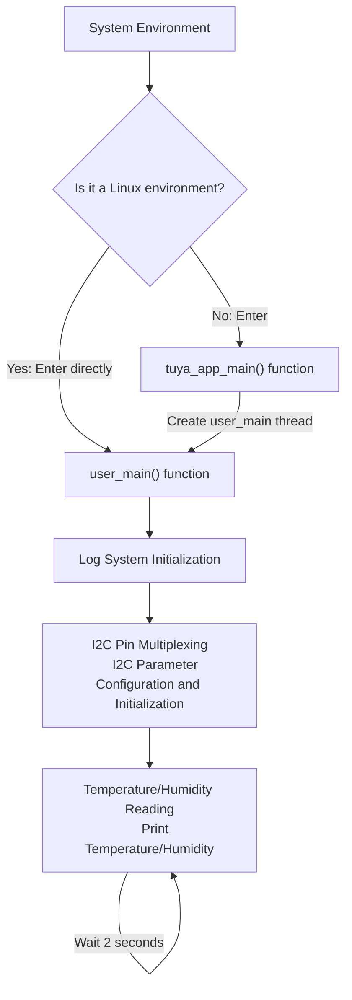

# I2C

## I2C Introduction

I2C (Inter-Integrated Circuit): is a **synchronous serial communication protocol** used to connect **low-speed** peripheral devices. It uses two bus lines: **Serial Data Line (SDA) and Serial Clock Line (SCL)**, adopting a **multi-master-slave architecture**, where each device has a unique address for identification. The I2C protocol supports half-duplex communication and is widely used for communication between microcontrollers and peripherals such as sensors, memory, etc.

## Key I2C Concepts Explained

- Start Condition: When SCL remains high, SDA transitions from high to low level, indicating the **start of data transmission**.

- Stop Condition: When SCL remains high, SDA transitions from low to high level, indicating the **end of data transmission**.

- Acknowledge Signal (ACK/NACK): After receiving 8 bits of data, the receiving device sends a specific low-level pulse (ACK) to the transmitting device to indicate **data has been received**, or a high level (NACK) to indicate it does not wish to continue transmission.

<figure style="text-align: center">
  
  <figcaption style="font-size: 0.8em; color: #666">I2C Communication Timing Diagram | Source: <a href="https://zhuanlan.zhihu.com/p/715442819">Zhihu</a></figcaption>
</figure>

<figure style="text-align: center">
  
  <figcaption style="font-size: 0.8em; color: #666">I2C Frame Structure Diagram | Source: <a href="https://zhuanlan.zhihu.com/p/715442819">Zhihu</a></figcaption>
</figure>

- Slave Device Address: I2C supports 7-bit, 8-bit, and 10-bit addressing modes. The 7-bit address mode can address up to 127 devices, with an address range of 0x07-0x78.

    * `I2C` 7-bit Address

    In the 7-bit addressing process, the slave address is transmitted starting from the first byte after the start signal. The first 7 bits of this byte are the slave address, and the 8th bit is the read/write bit, where 0 indicates write and 1 indicates read.

     
    
    * `I2C` 8-bit Address

    Some manufacturers refer to 8-bit addresses, but actually include the read/write bit. For example, write address 0x92, read address 0x93. However, the slave address is still the first 7 bits.

    

    * `I2C` 10-bit Address

    The 10-bit address occupies 2 bytes.

    The first 7 bits are `1111 0xx`, and the following two bits `xx` are the two most significant bits of the 10-bit address. The 8th bit of the first byte is the read/write bit. The second byte is used for multiple slave device acknowledgments.

    

- Transmission Rate:

    Standard Mode: 100kbit/s

    Fast Mode: 400kbit/s

    High-Speed Mode: 3.4Mbit/s

## I2C Usage Process

1. I2C Parameter Configuration: Call the tkl_io_pinmux_config() function for **pin multiplexing**, **initialize the cfg structure**, set parameters such as master/slave mode, communication rate, address width, etc.

2. I2C Initialization: Call the tkl_i2c_init() function to **initialize the I2C interface**

3. Data Transmission/Reception: Use read/write functions to communicate with the slave device

4. Resource Release: After the operation is complete, if I2C is no longer needed, call the tkl_i2c_deinit() function to **release resources**.

## Example Code Configuration

### Development Board Configuration

Before using this example, confirm that the **correct development board is selected** in the I2C project root directory.

- Development Board Selection Method:
    - Execute the board selection command in the project root directory, input the model of the development board to select:
        ```shell
        tos.py config choice
        ```
    - For example, to select TUYA_T5AI_CORE:
        Because **T5AI has multiple models**, such as TUYA_T5AI_CORE, TUYA_T5AI_BOARD, etc. After successfully selecting the T5AI development board using `tos.py config choice`, you must also use the `tos.py config menu` command to enter the configuration menu and continue selecting the T5AI sub-model under the `Choice a board` directory.

### I2C Parameter Configuration:

- I2C Selection and Pin Multiplexing:
    - Pin Multiplexing:
        Modifying the EXAMPLE_I2C_SCL_PIN and EXAMPLE_I2C_SDA_PIN pins in the .c file does not actually change the SCL and SDA pins; **modification must be done in the app_default.config file or using tos\.py config menu for configuration**

    - I2C Selection:
        To select I2C, you need to **pass in the corresponding macro definition during initialization**. For example, to use I2C1, pass in TUYA_I2C_NUM_1, and when performing I2C **read/write operations, also pass in the correct port**, e.g., sht3x_read_temp_humi(TUYA_I2C_NUM_1, &temp, &humi);

- I2C Parameter Configuration:

    ```c
    // Typical I2C configuration parameters
    TUYA_IIC_BASE_CFG_T cfg = {
        cfg.role = TUYA_IIC_MODE_MASTER;        // Master mode (as master)
        cfg.speed = TUYA_IIC_BUS_SPEED_100K;    // Speed: 100K Hz
        cfg.addr_width = TUYA_IIC_ADDRESS_7BIT; // 7-bit address
    };
    ```

## Compilation and Running

### Compilation Steps

1. Configure the TuyaOpen development environment and enter the **project root directory**

2. Ensure the target platform (T5AI/T3) is correctly selected

3. Compile the project to generate the executable firmware

### Running and Logs

Burn the compiled firmware to the target device. After the device starts, use tos\.py monitor to enter log mode.

Expected running logs:

```c
ap0:W(72277):[01-01 00:01:12 ty I][example_i2c.c:124] sht3x temp:28.753, humi:44.455
ap0:W(74278):[01-01 00:01:14 ty I][example_i2c.c:124] sht3x temp:28.589, humi:40.468
ap0:W(76279):[01-01 00:01:16 ty I][example_i2c.c:124] sht3x temp:28.435, humi:37.937
```

## Example Code Flow

1. System Initialization: If it's a Linux environment, directly call user_main(); otherwise, enter tuya_app_main() to create a user_main() thread

2. Log System Initialization: **Initialize the log system** via the tal_log_init() function

3. I2C Parameter Configuration: Call the tkl_io_pinmux_config() function for **pin multiplexing**, **initialize the cfg structure**, set parameters such as master/slave mode, communication rate, address width, etc.

4. I2C Initialization: Call the tkl_i2c_init() function to **initialize the I2C interface**

5. Temperature and Humidity Reading: Based on macro definitions, choose to read temperature and humidity from SHT3X or SHT4X, and print the values, with a cycle of 2 seconds



## Main Interface Examples

The Tuya IoT platform provides **Hardware Abstraction Layer** (TAL, Tuya Abstract Layer) and **Hardware Driver Layer** (TKL, Tuya Kernel Layer) interfaces to uniformly access hardware resources.

- Initialize I2C:

    ```c
    OPERATE_RET tkl_i2c_init(UCHAR_T port, CONST TUYA_IIC_BASE_CFG_T *cfg);
    ```

    - Function: Initialize the specified I2C port

    - Parameters:
        port: I2C port number (e.g., TUYA_I2C_NUM_0)
        cfg: Pointer to the I2C configuration structure

    - Return value: Operation result status code
***
- I2C Pin Multiplexing:

    ```c
    OPERATE_RET tkl_io_pinmux_config(TUYA_PIN_NAME_E pin, TUYA_PIN_FUNC_E pin_func);
    ```
    
    - Function: Configure pin multiplexing function, determining the specific role of the physical pin

    - Parameters:
        pin: Specific pin number (e.g., EXAMPLE_I2C_SCL_PIN)
        pin_func: Target function (e.g., TUYA_IIC1_SCL)

    - Return value: Operation result status code
***
- I2C Master Data Send:
    
    ```c
    OPERATE_RET tkl_i2c_master_send(TUYA_I2C_NUM_E port, USHORT_T dev_addr, CONST VOID_T *data, UINT_T size, BOOL_T xfer_pending);
    ```
    
    - Function: As an I2C master, send data to the specified slave device

    - Parameters:
        port: I2C port number
        dev_addr: Slave device address
        data: Pointer to the data buffer to be sent
        size: Length of data to be sent
        xfer_pending: Whether to maintain bus control (for continuous operations)

    - Return value: Operation result status code
***
- I2C Master Data Receive:
    
    ```c
    OPERATE_RET tkl_i2c_master_receive(TUYA_I2C_NUM_E port, USHORT_T dev_addr, VOID_T *data, UINT_T size,BOOL_T xfer_pending);
    ```
    
    - Function: As an I2C master, receive data from the specified slave device

    - Parameters:
        port: I2C port number
        dev_addr: Slave device address
        data: Pointer to the receive data buffer
        size: Expected receive data length
        xfer_pending: Whether to maintain bus control
***
- I2C Deinitialization:
    ```c
    OPERATE_RET tkl_i2c_deinit(UCHAR_T port);
    ```
    
    - Function: Close and release I2C resources

    - Parameters:
        port: I2C port number

    - Return value: Operation result status code

## Supported Platforms

This example code collects temperature and humidity sensor data using I2C and supports the following Tuya IoT development platforms:

| Platform Name | Core Features | Typical Application Scenarios |
|------|-------|-------|
| T5AI | High-computing-power AIoT platform, typically integrating DSP/NPU | Complex edge AI computing, image recognition, voice processing |
| T3 | General-purpose high-performance MCU platform, based on ARM Cortex-M series cores | Smart appliances and industrial control requiring strong processing capabilities |
| T2 | Cost-optimized general-purpose MCU platform | Basic smart home devices, sensor nodes |
| ESP32 | Popular IoT platform with integrated Wi-Fi and Bluetooth | Various IoT devices requiring wireless connectivity |
| LN882H | Domestic RISC-V architecture Wi-Fi SoC | Smart home, consumer electronics |
| BK7231X | Broadcom-integrated Wi-Fi IoT chip | Smart lighting, smart sockets, etc. |

## Precautions

- Deadlock Handling: When the master device resets abnormally, it may cause an I2C bus deadlock. Solutions include pushing 9 clocks to the **clock bus or resetting the slave device**.

- Bus Arbitration: Bus contention may occur in multi-master systems. The I2C protocol prevents data corruption through an **arbitration mechanism**.

- Timing Requirements: Strictly adhere to I2C timing requirements, especially during start, stop, and acknowledge signal phases.

- Slave Device Characteristics: Different slave devices may have special requirements. For example, AT24C02 EEPROM requires a 5ms delay after each write before continuing to write.

For more information, please visit the link
https://tuyaopen.ai/zh/docs/peripheral/support_peripheral_list