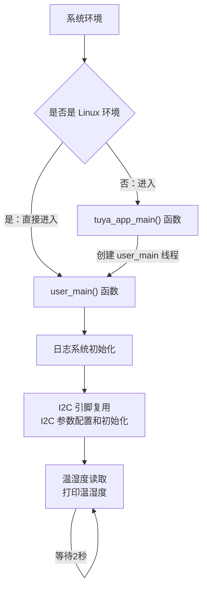

# I2C

## I2C 简介

I2C（ Inter-Integrated Circuit ）: 是一种**同步串行通信协议**，用于连接**低速**周边设备。它使用两条总线线路：**串行数据线（ SDA ）和串行时钟线（ SCL ）**，采用**多主从架构**，每个设备都有唯一地址识别。I2C协议支持半双工通信，广泛应用于微控制器与传感器、存储器等外设之间的通信。

## I2C 关键概念解释

- 起始信号（ Start Condition ）：当 SCL 保持高电平时，SDA 由高电平向低电平跳变，表示**开始传输数据**。

- 停止信号（ Stop Condition ）：当 SCL 保持高电平时，SDA 由低电平向高电平跳变，表示**结束传输数据**。

- 应答信号（ ACK/NACK ）：接收数据的设备在接收到 8bit 数据后，向发送设备发出特定的低电平脉冲（ ACK ）表示**已收到数据**，高电平（ NACK ）表示不希望继续传输。

<figure style="text-align: center">
  
  <figcaption style="font-size: 0.8em; color: #666">I2C通信时序图 | 来源：<a href="https://zhuanlan.zhihu.com/p/715442819">知乎</a></figcaption>
</figure>

<figure style="text-align: center">
  
  <figcaption style="font-size: 0.8em; color: #666">I2C帧结构图 | 来源：<a href="https://zhuanlan.zhihu.com/p/715442819">知乎</a></figcaption>
</figure>

- 从设备地址：I2C 支持7位、8位和10位寻址方式。7位地址模式最多可寻址127个设备，地址范围 0x07-0x78 。

    * `I2C` 7位地址

    在7位寻址过程中，从机地址在启动信号后的第一个字节开始传输，该字节的前7位为从机地址，第8位为读写位，其中0表示写，1表示读。

    
    
    * `I2C` 8位地址

    一些厂商说的是8位地址，实际上是把读写位也算进去了，例如写地址0x92，读地址0x93。但是从机地址还是前7位。

    

    * `I2C` 10位地址

    10位地址会占用2个字节。

    前7位是 `1111 0xx` ，后面两位 `xx` 是10位地址的2个最高有效位。第1个字节的第8位是读写位。第2个字节用于多个从设备应答的情况。

    

- 传输速率：

    标准模式：100kbit/s

    快速模式：400kbit/s

    高速模式：3.4Mbit/s

## I2C 的使用流程

1. I2C 参数配置：调用 tkl_io_pinmux_config() 函数进行**引脚复用**，**初始化 cfg 结构体**，设置主从模式、通信速率、地址宽度等参数

2. I2C 初始化：调用 tkl_i2c_init() 函数对**I2C接口初始化**

3. 数据收发：使用读写函数与从设备进行通信

4. 资源回收：操作完成后，若不再使用 I2C ，可调用 tkl_i2c_deinit() 函数 **释放资源**。

## 示例代码配置

### 开发板配置

在使用本例程前，需在 I2C 项目根目录中确认**开发板是否选择正确**。

- 开发板选择方法：

    - 在项目根目录中执行开发板选择命令，输入要选择的开发板的型号：

        ```shell
        tos.py config choice
        ```

    - 比如要选择 TUYA_T5AI_CORE ：

        因为**T5AI 有多个型号**，如 TUYA_T5AI_CORE 、 TUYA_T5AI_BOARD等。在使用 `tos.py config choice` 成功选择 T5AI 开发板后,还要使用 `tos.py config menu` 命令进入配置菜单，在 `Choice a board` 目录下继续选择 T5AI的子型号。

### I2C参数配置：

- I2C选择和引脚复用：

    - 引脚复用：

        在 .c 文件中修改 EXAMPLE_I2C_SCL_PIN 和 EXAMPLE_I2C_SDA_PIN 引脚并不会真正改变 SCL 和 SDA 的引脚，**需要在 app_default.config 文件中进行修改，或使用 tos\.py config menu 进行配置**

    - I2C选择：
        
        要选择 I2C 的话需要在**初始化时传入对应的宏定义**，比如要使用 I2C1 就传入 TUYA_I2C_NUM_1 ，并且在进行 I2C **读写时也要传入正确的 port**， 比如 sht3x_read_temp_humi(TUYA_I2C_NUM_1, &temp, &humi); 

- I2C参数配置：

    ```c
    // 典型的I2C配置参数
    TUYA_IIC_BASE_CFG_T cfg = {
        cfg.role = TUYA_IIC_MODE_MASTER;        //主模式（作为主机）
        cfg.speed = TUYA_IIC_BUS_SPEED_100K;    //速度：100K Hz
        cfg.addr_width = TUYA_IIC_ADDRESS_7BIT; //7位地址
    };
    ```

## 编译与运行

### 编译步骤

1. 配置好 TuyaOpen 开发环境，进入到**项目根目录**

2. 确保目标平台（ T5AI/T3 ）选择正确

3. 编译工程，生成可执行固件

### 运行及日志

将编译好的固件烧录到目标设备。设备启动后，使用 tos\.py monitor 进入日志模式。

预期运行日志：

```c
ap0:W(72277):[01-01 00:01:12 ty I][example_i2c.c:124] sht3x temp:28.753, humi:44.455
ap0:W(74278):[01-01 00:01:14 ty I][example_i2c.c:124] sht3x temp:28.589, humi:40.468
ap0:W(76279):[01-01 00:01:16 ty I][example_i2c.c:124] sht3x temp:28.435, humi:37.937
```

## 示例代码流程

1. 系统初始化：如果是 Linux 环境，直接调用 user_main()；其他环境则进入 tuya_app_main() 创建 user_main() 线程

2. 日志系统初始化：通过 tal_log_init() 函数**初始化日志系统**

3. I2C 参数配置：调用 tkl_io_pinmux_config() 函数进行**引脚复用**，**初始化 cfg 结构体**，设置主从模式、通信速率、地址宽度等参数

4. I2C 初始化：调用 tkl_i2c_init() 函数对**I2C接口初始化**

5. 温湿度读取：根据宏定义选择读取 SHT3X 还是 SHT4X 的温湿度，并打印温湿度，周期为2秒



## 主要接口举例

涂鸦IoT平台提供了**硬件抽象层**（TAL, Tuya Abstract Layer）和**硬件驱动层**（TKL, Tuya Kernel Layer）接口来统一访问硬件资源。

- 初始化 I2C：

    ```c
    OPERATE_RET tkl_i2c_init(UCHAR_T port, CONST TUYA_IIC_BASE_CFG_T *cfg);
    ```

    - 功能：初始化指定的 I2C 端口

    - 参数：

        port：I2C端口号（如 TUYA_I2C_NUM_0 ）

        cfg：指向 I2C 配置结构体的指针

    - 返回值：操作结果状态码
***
- I2C 引脚复用：

    ```c
    OPERATE_RET tkl_io_pinmux_config(TUYA_PIN_NAME_E pin, TUYA_PIN_FUNC_E pin_func);
    ```
    
    - 功能：配置引脚复用功能，决定物理引脚的具体作用

    - 参数：

        pin: 具体引脚编号（如 EXAMPLE_I2C_SCL_PIN）

        pin_func: 目标功能（如 TUYA_IIC1_SCL）

    - 返回值：操作结果状态码
***
- I2C 主设备数据发送：
    
    ```c
    OPERATE_RET tkl_i2c_master_send(TUYA_I2C_NUM_E port, USHORT_T dev_addr, CONST VOID_T *data, UINT_T size, BOOL_T xfer_pending);
    ```
    
    - 功能：作为I2C主设备向指定从设备发送数据

    - 参数：

        port: I2C端口号

        dev_addr: 从设备地址

        data: 待发送数据缓冲区指针

        size: 待发送数据长度

        xfer_pending: 是否保持总线控制（用于连续操作）

    - 返回值：操作结果状态码
***
- I2C 主设备数据接收：
    
    ```c
    OPERATE_RET tkl_i2c_master_receive(TUYA_I2C_NUM_E port, USHORT_T dev_addr, VOID_T *data, UINT_T size,BOOL_T xfer_pending);
    ```
    
    - 功能：作为I2C主设备从指定从设备接收数据

    - 参数：

        port: I2C端口号

        dev_addr: 从设备地址

        data: 接收数据缓冲区指针

        size: 期望接收数据长度

        xfer_pending: 是否保持总线控制
***
- I2C反初始化：
    ```c
    OPERATE_RET tkl_i2c_deinit(UCHAR_T port);
    ```
    
    - 功能：关闭并释放I2C资源

    - 参数：
        
        port：I2C端口号

    - 返回值：操作结果状态码

## 支持的平台

此示例代码是通过使用I2C来采集温湿度传感器的数据，支持以下涂鸦 IoT 开发平台：

|平台名称|核心特性|典型应用场景|
|------|-------|-------|
|​T5AI​​|高算力 AIoT 平台，通常集成 DSP/NPU|复杂的边缘AI计算、图像识别、语音处理|
|​T3|通用高性能 MCU 平台，基于 ARM Cortex-M 系列内核|需要较强处理能力的智能家电、工业控制|
|​T2​​ |成本优化的通用 MCU 平台 |基础的智能家居设备、传感器节点|
|​ESP32​​| 集成 Wi-Fi 和蓝牙的流行物联网平台| 需要无线连接的各种物联网设备|
|LN882H​​ |国产 RISC-V| 架构 Wi-Fi SoC 智能家居、消费电子|
|​BK7231X​​ |博通集成 Wi-Fi 的物联网芯片 |智能照明、智能插座等|

## 注意事项

- 死锁处理：当主设备异常复位时可能导致I2C总线死锁。解决方法包括推送9个Clock到**时钟总线或复位从设备**。

- 总线仲裁：多主机系统中可能发生总线竞争，I2C协议通过**仲裁机制**防止数据破坏。

- 时序要求：严格按照I2C时序要求操作，特别是在起始信号、停止信号和应答信号阶段。

- 从设备特性：不同从设备可能有特殊要求，如AT24C02 EEPROM每次写之后需要延时5ms才能继续写。

获取更多信息，请到 https://tuyaopen.ai/zh/docs/peripheral/support_peripheral_list